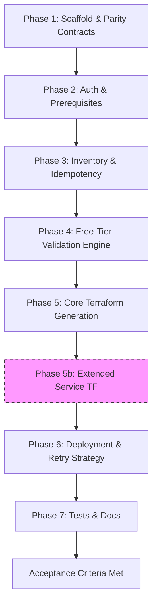
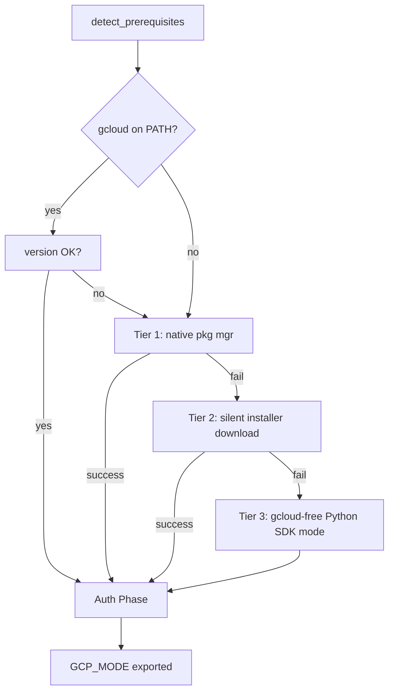

# GCP Equivalent Plan (Parity with ./cloud/OCI)

> **Research baseline**: GCP Always Free tier table sourced from
> `https://cloud.google.com/free/docs/free-cloud-features` — last updated
g> 2026-02-20 UTC. All limits below are authoritative as of that date.

---

## Objective
Build `./cloud/GCP` as a provider-specific equivalent of `./cloud/OCI`,
preserving the same workflow shape:
- Inventory-first/idempotent execution
- Interactive + non-interactive operation
- Free-tier guardrails before deploy
- Terraform file generation and apply flow
- Tests, docs, and usage parity

### Verification Sources (2026)

- Google Cloud Free Tier limits: https://docs.cloud.google.com/free/docs/free-cloud-features
- Terraform authentication on GCP (ADC, WIF, SA keys): https://docs.cloud.google.com/docs/terraform/authentication
- Terraform Google provider reference: https://registry.terraform.io/providers/hashicorp/google/latest/docs/guides/provider_reference

---

## GCP Always Free Tier — Complete Authoritative Catalog

> This section is the canonical source for all free-tier constants used in
> shell scripts, Python validator, and Terraform `check` blocks. Update all
> three locations when limits change.

### Infrastructure / Compute

| Resource | Always Free Limit | Notes |
|---|---|---|
| **Compute Engine e2-micro** | 1 non-preemptible VM · 744 hrs/month | Regions: `us-west1`, `us-central1`, `us-east1` only. Cumulative hours across ALL e2-micro in the billing account. No GPUs/TPUs. |
| **Compute Engine — Standard PD** | 30 GB-months standard persistent disk | Shared across all instances |
| **Compute Engine — Egress** | 1 GB outbound/month from North America | Excludes China and Australia destinations |
| **GKE — cluster management fee** | 1 free Autopilot **or** zonal Standard cluster/month | Management fee waiver only; compute/networking billed normally |
| **Cloud Run (request-based)** | 2 M requests/month · 360,000 GB-seconds memory · 180,000 vCPU-seconds · 1 GB egress NA/month | Other billing modes have separate limits |
| **Cloud Run Functions** | 2 M invocations/month · 400,000 GB-seconds · 200,000 GHz-seconds · 5 GB egress/month | Both background and HTTP invocations |
| **App Engine (Standard only)** | 28 hrs/day F1 instances · 9 hrs/day B1 instances · 1 GB outbound/day | Standard environment only |
| **Agent Engine (Vertex AI)** | 180,000 vCPU-seconds (50 hrs)/month · 360,000 GiB-seconds (100 hrs)/month | AI agent workloads on Vertex AI Agent Engine |

### Storage

| Resource | Always Free Limit | Notes |
|---|---|---|
| **Cloud Storage** | 5 GB-months regional (US) · 5,000 Class A ops/month · 50,000 Class B ops/month · 100 GB egress NA/month | Only `us-east1`, `us-west1`, `us-central1`; combined across all three |
| **Firestore** | 1 GiB storage/project · 50,000 reads/day · 20,000 writes/day · 20,000 deletes/day · 10 GiB egress/month | Per-project limits |
| **BigQuery** | 1 TiB querying/month · 10 GiB storage/month | Storage free tier excludes streaming inserts |
| **Artifact Registry** | 0.5 GB storage/month | Any repository format |
| **Cloud Source Repositories** | 5 users/billing account · 50 GB storage/month · 50 GB egress/month | Git-compatible managed source control |
| **Cloud Shell** | 5 GB persistent disk (home directory) | Always free |

### Messaging & Integration

| Resource | Always Free Limit | Notes |
|---|---|---|
| **Pub/Sub** | 10 GiB messages/month | First 10 GiB (publish + subscribe combined) |
| **Workflows** | 5,000 internal steps/month · 2,000 external HTTP calls/month | Serverless orchestration |
| **Application Integration** | 400 executions/month · 20 GiB data processed/month · 2 connection nodes | iPaaS connector platform |

### Security & Secrets

| Resource | Always Free Limit | Notes |
|---|---|---|
| **Secret Manager** | 6 active secret versions/month · 10,000 access operations/month · 3 rotation notifications/month | Per billing account |
| **Cloud KMS (Autokey-created keys only)** | 100 active key versions/month · 10,000 cryptographic operations/month | Only keys created via Cloud KMS Autokey |
| **reCAPTCHA Enterprise** | 10,000 assessments/month | Bot/fraud detection |

### Observability

| Resource | Always Free Limit | Notes |
|---|---|---|
| **Cloud Logging** | 50 GiB log ingestion/project/month · Default retention at no cost | `_Default` and `_Required` log buckets |
| **Cloud Monitoring** | All non-chargeable GCP metrics · 1 M time series returned/billing account/month (API reads) | Custom metrics billed after allotment |

### CI/CD & DevOps

| Resource | Always Free Limit | Notes |
|---|---|---|
| **Cloud Build** | 2,500 build-minutes/month (`e2-standard-2`) | First pool machine type |
| **Cloud Deploy** | 1st active delivery pipeline/billing account | Subsequent pipelines billed |
| **Workload Manager** | 5,000 resource evaluations/month | SAP/HANA workload compliance scanning |

### AI / ML APIs

| Resource | Always Free Limit | Notes |
|---|---|---|
| **Cloud Natural Language API** | 5,000 units/month | Sentiment, entity, syntax |
| **Cloud Vision API** | 1,000 units/month | Image labeling, OCR, face detection |
| **Speech-to-Text V1** | 60 minutes/month | Standard model only |
| **Video Intelligence API** | 1,000 units/month | Shot detection, label detection |
| **Web Risk** | 100,000 `uris.search` calls/month | Safe Browsing threat detection |

### Networking (cost traps and implicit free primitives)

| Resource | Status | Notes |
|---|---|---|
| **VPC networks** | Free (up to 5/project) | Network creation has no cost; ingress always free |
| **Firewall rules** | Free (logging disabled) | Firewall rule logging incurs cost if enabled |
| **Internal IP** | Always free | No address charges |
| **Static external IP (attached)** | Free while attached to running instance | Billed when reserved but NOT attached |
| **External IP (general)** | Not listed as Always Free | Treat as potentially billable; avoid reserving static IPs by default |
| **Cloud DNS** | **NOT free** — $0.20/zone/month | Budget-guard: warn; do not create by default |
| **Cloud NAT** | **NOT free** — $0.044/gateway/hr | Budget-guard: warn; do not create by default |
| **Load Balancer** | **NOT free** — per-rule + data-processing charges | Block by default for free-tier deployments |
| **VPC egress (NA→NA)** | 1 GB/month included | Covered by Compute Engine free egress |

---

## OCI ↔ GCP Service Mapping

| Category | OCI Resource | GCP Equivalent | Parity Assessment |
|---|---|---|---|
| **Compute (x86)** | VM.Standard.E2.1.Micro ×2 | `e2-micro` ×1 (744 hrs/month) | OCI more generous (2 VMs vs 1) |
| **Compute (ARM)** | VM.Standard.A1.Flex (4 OCPU / 24 GB) | No direct equivalent | OCI wins — GCP has no free ARM VM |
| **Object Storage** | Object Storage (10 GB) | Cloud Storage (5 GB, US only) | OCI slightly more generous |
| **Block Storage** | Block Volume (200 GB total) | Standard PD (30 GB-months) | OCI significantly more generous |
| **Networking** | VCN + Subnet + IGW + Route Table | VPC + Subnet + Firewall rules | Structural parity |
| **NoSQL DB** | Autonomous JSON/NoSQL | Firestore (1 GiB, 50K reads/day) | GCP Firestore more feature-rich |
| **Analytics** | Autonomous DW (20 GB ECPU) | BigQuery (1 TiB query, 10 GiB storage) | GCP BigQuery far more capable |
| **Functions** | OCI Functions (2M calls, 400K GB-s) | Cloud Run Functions (2M calls, 400K GB-s) | Near-exact parity |
| **Streaming** | OCI Streaming (1M events, 7 day retention) | Pub/Sub (10 GiB/month) | GCP more generous |
| **Secrets** | OCI Vault (20 keys, 150 crypto/month) | Secret Manager (6 versions, 10K ops) | OCI more generous on ops |
| **Monitoring** | Logging + Monitoring basics | Cloud Logging (50 GiB/project) + Monitoring | GCP more generous on log volume |
| **Container Registry** | OCIR (500 MB) | Artifact Registry (0.5 GB) | Exact parity |
| **Source Control** | OCI DevOps Code Repository | Cloud Source Repositories (50 GB, 5 users) | GCP more generous |
| **CI Build** | OCI DevOps Build (300 min/month) | Cloud Build (2,500 min/month) | GCP significantly more generous |
| **CD Pipeline** | OCI DevOps Deploy (3 environments) | Cloud Deploy (1 pipeline free) | Comparable |
| **Kubernetes** | OKE (cluster mgmt free) | GKE (1 cluster mgmt fee waiver) | Near parity |
| **Serverless Containers** | — (no free OCI equivalent) | Cloud Run (2M req, 360K GB-s) | **GCP net-new** |
| **PaaS App Hosting** | — | App Engine Standard (28 hr F1/day) | **GCP net-new** |
| **Workflow Orchestration** | — | Workflows (5K steps, 2K HTTP calls/month) | **GCP net-new** |
| **Vision AI** | — | Cloud Vision (1,000 units/month) | **GCP net-new** |
| **NLP API** | — | Cloud Natural Language (5,000 units/month) | **GCP net-new** |
| **Speech AI** | — | Speech-to-Text (60 min/month) | **GCP net-new** |
| **Video AI** | — | Video Intelligence API (1,000 units/month) | **GCP net-new** |
| **AI Agent Runtime** | — | Agent Engine (180K vCPU-s, 360K GiB-s/month) | **GCP net-new** |
| **KMS** | Vault Master Key (free) | Cloud KMS Autokey (100 versions, 10K ops) | Rough parity |
| **Bot Protection** | — | reCAPTCHA Enterprise (10K assessments/month) | **GCP net-new** |
| **Cloud Shell** | — | Cloud Shell (5 GB persistent) | **GCP net-new** |
| **Web Security** | — | Web Risk (100K URL checks/month) | **GCP net-new** |
| **SAP Compliance** | — | Workload Manager (5K evaluations/month) | **GCP net-new** |

---

## Hard-Coded Free-Tier Constants (source of truth for all layers)

```bash
# ── Compute ────────────────────────────────────────────────────────────────
GCP_FREE_MACHINE_TYPE="e2-micro"
GCP_FREE_COMPUTE_HOURS_PER_MONTH=744          # combined across all e2-micro in billing account
GCP_FREE_COMPUTE_REGIONS=("us-west1" "us-central1" "us-east1")
GCP_FREE_STANDARD_PD_GB=30
GCP_FREE_COMPUTE_EGRESS_GB=1                  # NA → all (excl. China, Australia)

# ── Storage ────────────────────────────────────────────────────────────────
GCP_FREE_STORAGE_GB=5                         # Cloud Storage, US regions only
GCP_FREE_STORAGE_REGIONS=("us-east1" "us-west1" "us-central1")
GCP_FREE_STORAGE_CLASS_A_OPS=5000
GCP_FREE_STORAGE_CLASS_B_OPS=50000
GCP_FREE_STORAGE_EGRESS_GB=100               # NA to all (excl. China, AU)

# ── Firestore ──────────────────────────────────────────────────────────────
GCP_FREE_FIRESTORE_STORAGE_GIB=1
GCP_FREE_FIRESTORE_READS_PER_DAY=50000
GCP_FREE_FIRESTORE_WRITES_PER_DAY=20000
GCP_FREE_FIRESTORE_DELETES_PER_DAY=20000
GCP_FREE_FIRESTORE_EGRESS_GIB_MONTH=10

# ── BigQuery ───────────────────────────────────────────────────────────────
GCP_FREE_BIGQUERY_QUERY_TIB=1
GCP_FREE_BIGQUERY_STORAGE_GIB=10

# ── Messaging ──────────────────────────────────────────────────────────────
GCP_FREE_PUBSUB_GIB_MONTH=10

# ── Serverless ────────────────────────────────────────────────────────────
GCP_FREE_FUNCTIONS_INVOCATIONS=2000000
GCP_FREE_FUNCTIONS_GB_SECONDS=400000
GCP_FREE_FUNCTIONS_GHZ_SECONDS=200000
GCP_FREE_FUNCTIONS_EGRESS_GB=5

GCP_FREE_CLOUDRUN_REQUESTS=2000000
GCP_FREE_CLOUDRUN_GB_SECONDS=360000
GCP_FREE_CLOUDRUN_VCPU_SECONDS=180000
GCP_FREE_CLOUDRUN_EGRESS_GB=1

# ── Security ──────────────────────────────────────────────────────────────
GCP_FREE_SECRET_VERSIONS=6
GCP_FREE_SECRET_ACCESS_OPS=10000
GCP_FREE_SECRET_ROTATION_NOTIFICATIONS=3

# ── DevOps ────────────────────────────────────────────────────────────────
GCP_FREE_ARTIFACT_REGISTRY_GB=0.5
GCP_FREE_BUILD_MINUTES=2500

# ── Observability ─────────────────────────────────────────────────────────
GCP_FREE_LOGGING_GIB_PER_PROJECT=50

# ── Kubernetes ────────────────────────────────────────────────────────────
GCP_FREE_GKE_CLUSTERS=1                      # Management fee waiver only

# ── App Engine Standard ───────────────────────────────────────────────────
GCP_FREE_APP_ENGINE_F1_HOURS_PER_DAY=28
GCP_FREE_APP_ENGINE_B1_HOURS_PER_DAY=9

# ── Budget guards (non-free, block/warn by default) ───────────────────────
GCP_COST_WARN_CLOUD_DNS=true                  # $0.20/zone/month
GCP_COST_WARN_CLOUD_NAT=true                  # $0.044/gateway/hr
GCP_COST_WARN_LOAD_BALANCER=true              # per-rule + data-processing
```

---

## Constraints & Design Rules

- Keep command and UX semantics aligned with OCI where possible.
- Replace OCI-specific auth/inventory logic with GCP-native mechanisms.
- Enforce only GCP Always Free constraints with explicit constants/checks.
- Avoid adding extra UX/features outside OCI parity baseline for Iteration 1.
- Prefer deterministic defaults for free-tier eligible regions/resources.
- **Platform-agnostic installation**: all prerequisite installation (gcloud, terraform, Python packages)
  must be fully non-interactive and work on Windows, macOS, Linux without any user prompts. Use `/S`
  flag on Windows, `--disable-prompts` on Linux/macOS; fall back to gcloud-free Python SDK mode
  when CLI installation is not possible.
- **gcloud-optional design**: the core workflow (inventory → validate → Terraform generate → apply) must
  function when only Python + `google-auth` + SA key are available. gcloud is the preferred UX layer;
  Python SDK is the guaranteed fallback. Terraform never requires gcloud directly.
- **Budget guard**: Proactively warn (never silently create) any resource with
  per-use cost even at small scale (Cloud DNS, Cloud NAT, Load Balancers).
- **Billing account required**: GCP requires a valid payment method even for
  Always Free usage. Surface billing-link check early in the auth flow.

---

## What OCI Does Well (Port These Patterns)

- **Inventory-first + idempotency**: discover everything before planning/creating; keep explicit in-memory maps of existing resources.
- **Dual guardrails**: enforce free-tier limits in both the orchestrator (preflight) and Terraform (`check` blocks) so `terraform plan/apply` cannot exceed caps.
- **Non-interactive contract**: stable env-var interface (`NON_INTERACTIVE`, `AUTO_USE_EXISTING`, `AUTO_DEPLOY`, `SKIP_CONFIG`, `DEBUG`, `FORCE_REAUTH`) so automation/CI stays consistent across providers.
- **Retry/backoff as a first-class feature**: exponential backoff with env overrides (`RETRY_MAX_ATTEMPTS`, `RETRY_BASE_DELAY`) and provider-specific transient-error detection (OCI's out-of-capacity regex pattern is the template).
- **Command wrappers with timeouts**: a single `*_cmd()` wrapper that centralizes auth args, timeouts, and output capture; avoids hanging CLIs.
- **Input normalization for Windows/WSL**: strip CR/whitespace, detect WSL, and keep prompts safe for command substitution.
- **Safe JSON handling**: tolerant parsing helpers (OCI uses `safe_jq`) so missing/empty fields don't crash the workflow.
- **Backups before overwriting**: timestamped `.bak` copies of generated `.tf` files to preserve prior state.
- **Strict renderer parity tests**: Python renderers are unit-tested for required blocks and even formatting (2-space indentation), plus basic syntax sanity checks.
- **Config reload path**: ability to load prior config from `variables.tf` for repeat runs.

---

## GCP-Specific Differences From OCI (Design Implications)

| Topic | OCI Behaviour | GCP Difference | Impact |
|---|---|---|---|
| **Auth model** | API keys + browser session token | ADC (`gcloud init` + `application-default login`) **or** pure Python SDK (`google-auth` + SA key/WIF) without gcloud; `GOOGLE_APPLICATION_CREDENTIALS` read natively by Terraform | Dual-path: gcloud preferred; Python SDK as complete fallback — no gcloud required for non-interactive |
| **Project hierarchy** | Tenancy → Compartment | Organisation → Folder → **Project** (billing must be attached) | Validate `project_id`; surface billing-link check early |
| **Capacity errors** | "Out of Capacity" on free VMs | `RESOURCE_EXHAUSTED`, `quotaExceeded`, `ZONE_RESOURCE_POOL_EXHAUSTED` | Tune retry regex for GCP quota patterns; same patterns appear in both gcloud JSON errors and Python SDK exceptions |
| **Free compute limit** | Always-on time-unlimited VMs | 744 hrs/month combined — instance can run all month but only one | Add monthly-hours estimation to inventory; warn if e2-micro already exists |
| **Free storage location** | Object Storage free in home region | Cloud Storage free only in `us-east1`, `us-west1`, `us-central1` | Enforce region check for bucket creation |
| **Idle reclamation** | OCI reclaims VM if CPU < 20% for 7 days | GCP does **not** reclaim always-free VMs | No idle-reclaim warning needed |
| **SSH access** | Script generates + injects SSH key pair | GCP uses OS Login or metadata SSH keys | Default to metadata SSH key (simpler; no org policy needed) |
| **Terraform provider** | `hashicorp/oci` | `hashicorp/google` (~> 6.0) | Use `google` provider; pin minimum version |
| **Budget alerts** | N/A | `google_billing_budget` resource available | Optionally generate budget alert as safety net |

---

## Scope for Iteration 1

### Mandatory (Core Parity)
- Folder scaffold under `./cloud/GCP`
- Bash orchestrator (`setup_gcp_terraform.sh`)
- PowerShell equivalent (`setup_gcp_terraform.ps1`)
- Python CLI in `src/cloudbooter/`
- Terraform templates: `provider.tf`, `main.tf`, `variables.tf`, `data_sources.tf`, `cloud-init.yaml`
- All hard-coded free-tier constants (bash readonly + Python frozen dataclass)
- Docs: `README.md`, `QUICKSTART.md`, `FREE_TIER_LIMITS.md`, `OVERVIEW.md`
- Tests: renderer unit tests, integration workflow, e2e shape

### Optional Extensions (Phase 2)
- `storage.tf` — Cloud Storage bucket (free tier, US regions)
- `firestore.tf` — Firestore database (free tier)
- `functions.tf` — Cloud Run Functions (free tier)
- `pubsub.tf` — Pub/Sub topic + subscription (free tier)
- `secrets.tf` — Secret Manager (free tier versions)
- `logging.tf` — Cloud Logging export sink (free up to 50 GiB/project)
- `billing_budget.tf` — Budget alert resource ($0 threshold safety net)
- `artifact_registry.tf` — Artifact Registry (free 0.5 GB)
- `build.tf` — Cloud Build trigger (free 2,500 min/month)

---

## Work Plan

### High-Level Representation



### Phase 1 — Scaffold & Parity Contracts

1. Create `./cloud/GCP` structure mirroring OCI:
   ```
   cloud/GCP/
   ├── README.md
   ├── QUICKSTART.md
   ├── OVERVIEW.md
   ├── FREE_TIER_LIMITS.md
   ├── setup_gcp_terraform.sh
   ├── setup_gcp_terraform.ps1
   ├── requirements.txt
   ├── pyproject.toml
   ├── pytest.ini
   ├── run_tests.py
   ├── main.py
   ├── src/
   │   └── cloudbooter/
   │       ├── __init__.py
   │       ├── __main__.py
   │       └── cli.py
   └── tests/
       ├── conftest.py
       ├── test_renderers.py
       ├── test_free_tier.py
       ├── test_integration.py
       └── test_e2e_workflow.py
   ```
2. Port OCI environment variable contract; rename provider-specific keys:
   - New GCP-specific: `GCP_PROJECT_ID`, `GCP_REGION`, `GCP_ZONE`, `GCP_CREDENTIALS_FILE`, `GCP_BILLING_ACCOUNT_ID`, `GCP_CREATE_BUDGET_ALERT`, `GCP_ALLOW_PAID_RESOURCES`
   - Shared/retained: `NON_INTERACTIVE`, `AUTO_USE_EXISTING`, `AUTO_DEPLOY`, `SKIP_CONFIG`, `DEBUG`, `FORCE_REAUTH`, `RETRY_MAX_ATTEMPTS`, `RETRY_BASE_DELAY`
3. Generated file names identical to OCI: `provider.tf`, `main.tf`, `variables.tf`, `data_sources.tf`, `cloud-init.yaml`

### Phase 2 — Authentication & Prerequisites

#### 2.0 — Dependency Installation Strategy

All installation is fully non-interactive and automated. Three tiers are attempted in order; the first
to succeed is used. The script exports `GCP_MODE=gcloud` or `GCP_MODE=python` to signal downstream phases.



**Tier 1 — Native package manager (preferred, fully non-interactive)**

| Platform | Command |
|---|---|
| Debian/Ubuntu | `curl -fsSL https://packages.cloud.google.com/apt/doc/apt-key.gpg \| gpg --dearmor -o /usr/share/keyrings/cloud.google.gpg` → add repo → `apt-get install -y google-cloud-cli` |
| RHEL/Fedora/Rocky | Add `/etc/yum.repos.d/google-cloud-sdk.repo` → `dnf install -y google-cloud-cli` |
| macOS (Homebrew) | `brew install --cask google-cloud-sdk` (Homebrew itself auto-installs if missing via its own URL installer) |
| Windows (winget) | `winget install --id Google.CloudSDK --silent --accept-source-agreements --accept-package-agreements` |
| Any (snap) | `sudo snap install google-cloud-cli --classic` |

**Tier 2 — Silent installer download (fallback when no pkg manager available)**

| Platform | Command |
|---|---|
| Windows (PowerShell) | `Invoke-WebRequest -Uri 'https://dl.google.com/dl/cloudsdk/channels/rapid/GoogleCloudSDKInstaller.exe' -OutFile "$env:TEMP\gcloud.exe"` → `Start-Process -Wait -FilePath "$env:TEMP\gcloud.exe" -ArgumentList '/S', '/noreporting', "/D=$env:ProgramFiles\Google\Cloud SDK"` |
| Linux/macOS | `curl -fsSL https://sdk.cloud.google.com -o /tmp/install_gcloud.sh` → `bash /tmp/install_gcloud.sh --disable-prompts --install-dir=/opt/google-cloud-sdk` → `source /opt/google-cloud-sdk/path.bash.inc` |

Post-install (both tiers): `gcloud components install --quiet` to update bundled Python+PATH.

**Tier 3 — gcloud-free Python SDK mode (restricted/minimal environments)**

When gcloud cannot be installed, set `GCP_MODE=python` and skip all `gcloud_cmd()` calls.
All inventory, validation, and auth flow via Python `google-auth` + `google-cloud-*` SDK (already in
`requirements.txt`). Terraform does **not** need gcloud — it reads `GOOGLE_APPLICATION_CREDENTIALS`
natively. This mode is fully functional for non-interactive deployments.

```
requirements (auto-pip install if missing):
  google-auth>=2.38.0
  google-cloud-compute>=1.22.0
  google-cloud-storage>=2.19.0
  google-cloud-resource-manager>=1.14.0
  requests>=2.32.0
```

#### 2.1 — Terraform Installation (all platforms, no pkg manager required)

| Platform | Method |
|---|---|
| Linux/macOS | HashiCorp APT/YUM repo → `apt-get install -y terraform` **or** direct binary zip: `curl -fsSL https://releases.hashicorp.com/terraform/${TF_VERSION}/terraform_${TF_VERSION}_linux_amd64.zip` → unzip to `/usr/local/bin/` |
| Windows | `winget install --id Hashicorp.Terraform --silent` **or** direct zip: `Invoke-WebRequest` → unzip → add to `$env:PATH` |
| All | `pip install python-terraform` as pure-Python Terraform wrapper (last resort only) |

Version: pin to latest stable at script write time; `TERRAFORM_VERSION` env var overrides.

#### 2.2 — Interactive auth flow (`GCP_MODE=gcloud`)

1. Detect existing ADC: `gcloud auth application-default print-access-token 2>/dev/null`
2. If not found → `gcloud init` (combined project + auth setup, single browser flow)
3. Then: `gcloud auth application-default login` (separate ADC credential for Terraform)
4. Inspect: `gcloud auth list --format=json`

#### 2.3 — Non-interactive auth flow

| Priority | Signal | Action |
|---|---|---|
| 1 | `GCP_CREDENTIALS_FILE` (WIF or SA key) | Set `GOOGLE_APPLICATION_CREDENTIALS=$GCP_CREDENTIALS_FILE`; if `GCP_MODE=gcloud` also run `gcloud auth activate-service-account --key-file` |
| 2 | `GCP_IMPERSONATE_SERVICE_ACCOUNT` | Set `GOOGLE_IMPERSONATE_SERVICE_ACCOUNT`; requires TokenCreator role |
| 3 | `GOOGLE_APPLICATION_CREDENTIALS` already set | Use as-is; verify with `python -c "import google.auth; google.auth.default()"` |
| 4 | GCE/Cloud Run metadata server | Detected automatically by `google-auth`; no credentials needed |
| 5 | None found + `NON_INTERACTIVE=true` | Print error and exit with guidance |

#### 2.4 — Context resolution & validation

- `project_id` — from `GCP_PROJECT_ID` → `gcloud config get-value project` → Python `google.cloud.resourcemanager` list
- `region` / `zone` — from env → `GCP_REGION` default `us-central1`; enforce free-tier list
- Billing check: REST `GET https://cloudbilling.googleapis.com/v1/projects/{project}/billingInfo` (works in Python mode without gcloud)
- Enforce free-tier region: reject if not in `(us-west1, us-central1, us-east1)`

#### 2.5 — Command wrappers

- `gcloud_cmd()` — wraps `gcloud ... --project --format=json --quiet`; injects `timeout $GCP_CMD_TIMEOUT`; falls back to Python SDK call if `GCP_MODE=python`
- `safe_gcloud_json()` — tolerant parser equivalent to OCI's `safe_jq()`; accepts both gcloud JSON and Python SDK dict output
- `gcp_api_request()` — raw `requests.get/post` with `google.auth.transport.requests.AuthorizedSession`; used in Python mode and as escape hatch

### Phase 3 — Inventory & Idempotency

Populate global associative arrays before any Terraform generation:

```bash
declare -gA EXISTING_VPCS=()           # name → self_link
declare -gA EXISTING_SUBNETS=()        # name → region
declare -gA EXISTING_FIREWALLS=()      # name → network
declare -gA EXISTING_INSTANCES=()      # name → zone/machine_type
declare -gA EXISTING_DISKS=()          # name → zone/size_gb
declare -gA EXISTING_STATIC_IPS=()     # name → address/status
declare -gA EXISTING_BUCKETS=()        # name → location
declare -gA EXISTING_FIRESTORE_DBS=()  # name → type
```

1. `inventory_networking_resources()` — VPCs, subnets, firewall rules
2. `inventory_compute_instances()` — instances; flag e2-micro count + warn if combined hours near 744/month limit
3. `inventory_storage_resources()` — Cloud Storage buckets; flag non-free-tier regions
4. `inventory_disks()` — standard PD total GB vs 30 GB cap
5. `inventory_static_ips()` — flag reserved-but-unattached IPs (billable)
6. `inventory_firestore()` — Firestore databases
7. `display_resource_inventory()` — OCI-style dashboard summary
8. "Use existing" path — offer `terraform import` hints for discovered resources

### Phase 4 — Free-Tier Validation Engine

1. Free-tier constants in all three layers:
   - Bash: `readonly` variables (mirroring constants block above)
   - Python: `frozen=True` dataclass in `src/cloudbooter/free_tier.py`
   - Terraform: `check` blocks in `variables.tf`
2. `calculate_available_resources()` — headroom for e2-micro hours, PD GB, Storage GB, Secret versions
3. `validate_proposed_config()` checks:
   - Rejects machine type != e2-micro (or `GCP_ALLOW_PAID_RESOURCES=true` to override)
   - Rejects region not in free-tier list
   - Rejects standard PD > 30 GB (total)
   - Rejects Cloud Storage bucket in non-free region
   - **Warns** (not errors) on Cloud DNS / Cloud NAT / Load Balancer requests
4. Terraform `check` blocks:
   ```hcl
   check "e2_micro_machine_type" {
     assert {
       condition     = var.machine_type == "e2-micro"
       error_message = "Only e2-micro is Always Free. Got: ${var.machine_type}"
     }
   }
   check "compute_region_free_tier" {
     assert {
       condition     = contains(["us-west1", "us-central1", "us-east1"], var.region)
       error_message = "Compute Engine Always Free requires us-west1, us-central1, or us-east1."
     }
   }
   check "standard_pd_limit" {
     assert {
       condition     = var.boot_disk_size_gb <= 30
       error_message = "Standard PD Always Free cap is 30 GB."
     }
   }
   check "storage_region_free_tier" {
     assert {
       condition     = contains(["us-east1", "us-west1", "us-central1"], var.storage_region)
       error_message = "Cloud Storage Always Free requires us-east1, us-west1, or us-central1."
     }
   }
   ```

### Phase 5 — Core Terraform Generation

#### `provider.tf`
- `hashicorp/google ~> 6.0`
- ADC-based (no credentials block needed when ADC is active)
- Optional `credentials = var.credentials_file` for SA-key non-interactive mode

##### Provider Configuration Examples

**1. Application Default Credentials (ADC) — Baseline**
```hcl
# Simplest pattern; relies on gcloud ADC setup
# Prerequisites: gcloud init && gcloud auth application-default login
terraform {
  required_providers {
    google = {
      source  = "hashicorp/google"
      version = "~> 6.0"
    }
  }
}

provider "google" {
  project = var.project_id
  region  = var.region
}
```

**2. Workload Identity Federation (WIF) — Non-Interactive Preferred**
```hcl
# Uses WIF credential config file (no long-lived SA keys)
# Prerequisites: Create WIF pool, generate credential_config.json
terraform {
  required_providers {
    google = {
      source  = "hashicorp/google"
      version = "~> 6.0"
    }
  }
}

provider "google" {
  project     = var.project_id
  region      = var.region
  credentials = file(var.credentials_file)  # Path to WIF credential_config.json
}
```

**3. Service Account Key — Legacy Fallback**
```hcl
# Uses downloaded SA key JSON file
# Prerequisites: gcloud iam service-accounts keys create key.json --iam-account=...
terraform {
  required_providers {
    google = {
      source  = "hashicorp/google"
      version = "~> 6.0"
    }
  }
}

provider "google" {
  project     = var.project_id
  region      = var.region
  credentials = file(var.credentials_file)  # Path to SA key.json
}
```

**4. Service Account Impersonation — Advanced Pattern**
```hcl
# User authenticates with their own identity, acts as SA at runtime
# Prerequisites: roles/iam.serviceAccountTokenCreator on target SA
terraform {
  required_providers {
    google = {
      source  = "hashicorp/google"
      version = "~> 6.0"
    }
  }
}

provider "google" {
  project                     = var.project_id
  region                      = var.region
  impersonate_service_account = var.impersonate_service_account  # e.g., "terraform@project.iam.gserviceaccount.com"
}
```

**Script Logic (provider.tf generation):**
- Check `GCP_CREDENTIALS_FILE` env var → generate pattern 2 (WIF) or 3 (SA key, detected by `"type": "service_account"` in JSON)
- Check `GCP_IMPERSONATE_SERVICE_ACCOUNT` → generate pattern 4
- Fallback → generate pattern 1 (ADC)
- In `GCP_MODE=python` (gcloud-free), Terraform still uses one of the above auth patterns via `GOOGLE_APPLICATION_CREDENTIALS`; gcloud is not involved in the Terraform apply phase regardless of mode

#### `variables.tf`
- `project_id`, `region`, `zone`, `machine_type` (default `"e2-micro"`), `boot_disk_size_gb` (default `20`), `instance_name`, `ssh_public_key`, `storage_region`, `storage_bucket_name`, `credentials_file` (optional)
- All `check` blocks embedded

#### `data_sources.tf`
```hcl
data "google_compute_image" "ubuntu" {
  family  = "ubuntu-2404-lts-amd64"
  project = "ubuntu-os-cloud"
}
data "google_project" "current" {}
data "google_compute_zones" "available" { region = var.region }
```

#### `main.tf` — Always-generated resources
1. `google_compute_network` — custom VPC (`auto_create_subnetworks = false`)
2. `google_compute_subnetwork` — regional subnet (10.0.0.0/24)
3. `google_compute_firewall` ×2 — allow SSH (22) + allow ICMP
4. `google_compute_disk` — standard PD boot disk (≤ 30 GB)
5. `google_compute_instance` — e2-micro; SSH key via `metadata { "ssh-keys" = "..." }`; `metadata_startup_script` wired to cloud-init content
6. External IP: ephemeral (not reserved static — free while attached)

Optional resource (gated by `GCP_CREATE_BUDGET_ALERT=true`):
7. `google_billing_budget` — $0 threshold alert

#### `cloud-init.yaml`
- Mirror OCI structure; compatible with GCE `metadata_startup_script` / `user-data` key
- Set hostname, install packages, configure unattended-upgrades

#### Phase 5b — Extended Terraform files (optional modules)

| File | Resources | Free Tier Gate |
|---|---|---|
| `storage.tf` | `google_storage_bucket` | US region; 5 GB cap warning |
| `firestore.tf` | `google_firestore_database` | 1 GiB storage; 50K reads/day |
| `functions.tf` | `google_cloudfunctions2_function` | 2M invocations/month |
| `pubsub.tf` | `google_pubsub_topic`, `google_pubsub_subscription` | 10 GiB/month |
| `secrets.tf` | `google_secret_manager_secret` + version | 6 active versions cap |
| `logging.tf` | `google_logging_project_sink` | 50 GiB/project/month |
| `artifact_registry.tf` | `google_artifact_registry_repository` | 0.5 GB free |
| `build.tf` | `google_cloudbuild_trigger` | 2,500 min/month |

### Phase 6 — Deployment & Retry Strategy

1. Orchestration: `terraform init` → `terraform plan -out=tfplan` → `terraform apply tfplan`
2. GCP transient error patterns for retry:
   ```bash
   readonly GCP_RETRY_PATTERNS=(
     "RESOURCE_EXHAUSTED"
     "rateLimitExceeded"
     "quotaExceeded"
     "503 Service Unavailable"
     "Error 429"
     "Quota exceeded for quota metric"
     "ZONE_RESOURCE_POOL_EXHAUSTED"
   )
   ```
3. `out_of_quota_auto_apply()` — mirrors OCI's `out_of_capacity_auto_apply()`:
   - Detects patterns above in stderr
   - Retries with exponential backoff (`RETRY_MAX_ATTEMPTS`, `RETRY_BASE_DELAY`)
   - Tries next eligible zone within same free-tier region before giving up
4. Post-deploy output: instance external IP, `gcloud compute ssh` command, Cloud Console URLs

### Phase 7 — Tests & Docs

#### Test Suite
```
tests/
├── conftest.py           # Fixtures: mock gcloud output, temp dir, env overrides
├── test_renderers.py     # Each .tf renderer: required blocks, 2-space indent,
│                         # check blocks present, terraform validate passes
├── test_free_tier.py     # validate_proposed_config(): accepts valid / rejects over-limit /
│                         # rejects wrong region / rejects PD > 30 GB / warns DNS+NAT+LB
├── test_integration.py   # Auth → inventory → validate → generate (mocked gcloud fixtures)
└── test_e2e_workflow.py  # Full dry-run with NON_INTERACTIVE=true; all .tf generated;
                          # terraform validate passes
```

#### Documentation
1. `FREE_TIER_LIMITS.md` — Full authoritative table (matches catalog above) + OCI comparison + cost trap warnings
2. `QUICKSTART.md` — Create GCP project → attach billing → run script → SSH in
3. `OVERVIEW.md` — Architecture diagram, auth model, idempotency guarantees, retry strategy
4. `README.md` — OS-specific quick starts, env var reference table, troubleshooting section

---

## Deliverables

- `./cloud/GCP` module with full OCI-parity file layout
- Bash + PowerShell setup scripts
- Python CLI with free-tier validation
- Terraform generation + apply workflow (core + optional extended services)
- Dual free-tier enforcement: preflight validation + Terraform `check` blocks
- Budget guard layer for DNS / NAT / Load Balancer
- Test suite: renderer + free-tier validator + integration + e2e
- Complete documentation set

---

## Acceptance Criteria

- Interactive mode produces valid Terraform and deploys a free-tier e2-micro in a correct region.
- `NON_INTERACTIVE=true AUTO_DEPLOY=true` completes end-to-end with no prompts.
- Re-running does not create duplicate VPC / subnet / firewall / instance.
- Wrong machine type, wrong region, PD > 30 GB all blocked before `terraform apply`.
- Quota/transient errors during apply trigger automatic retry with backoff.
- All renderer unit tests pass; `terraform validate` passes on generated output.
- `FREE_TIER_LIMITS.md` contains every Always Free limit from the canonical GCP table (2026-02-19).

---

## Open Decisions — Resolved

| Decision | Resolution |
|---|---|
| Strict policy mode | Default: block non-free resources; `GCP_ALLOW_PAID_RESOURCES=true` to override |
| Auth baseline | Interactive: ADC (`gcloud init` + `application-default login`); Non-interactive: WIF preferred, SA JSON via `GCP_CREDENTIALS_FILE` fallback; gcloud-free Python SDK mode when gcloud unavailable |
| Zone auto-selection | Auto-select first available zone in chosen free-tier region via `gcloud compute zones list` |
| Budget/alerts | Optional; off by default; enabled via `GCP_CREATE_BUDGET_ALERT=true` |
| Env var naming | GCP-prefixed for provider-specific keys; generic keys shared across providers |
| Cloud DNS | Not provisioned by default ($0.20/zone/month); shown as "next step" suggestion |
| Cloud NAT | Not provisioned by default (billable hourly); documented as optional add-on |
| Load Balancer | Hard-blocked; requires `GCP_ALLOW_PAID_RESOURCES=true` to create |
| SSH access method | Default: metadata SSH keys; OS Login documented as advanced option |

---

## Official Documentation Reference

> Every URL below points to the canonical, official source. No third-party mirrors. Organised
> by topic matching the phases above. Verified 2026-02-23.

### Free Tier & Pricing

- https://cloud.google.com/free/docs/free-cloud-features
- https://cloud.google.com/free/docs/gcp-free-tier
- https://cloud.google.com/pricing/list
- https://cloud.google.com/compute/pricing
- https://cloud.google.com/storage/pricing
- https://cloud.google.com/firestore/pricing
- https://cloud.google.com/bigquery/pricing
- https://cloud.google.com/functions/pricing
- https://cloud.google.com/run/pricing
- https://cloud.google.com/secret-manager/pricing
- https://cloud.google.com/kms/pricing
- https://cloud.google.com/nat/pricing
- https://cloud.google.com/dns/pricing
- https://cloud.google.com/vpc/network-pricing
- https://cloud.google.com/billing/docs/how-to/budgets

---

### Google Cloud SDK / gcloud CLI — Installation

- https://cloud.google.com/sdk/docs/install
- https://cloud.google.com/sdk/docs/install-sdk
- https://cloud.google.com/sdk/docs/downloads-interactive
- https://cloud.google.com/sdk/docs/downloads-versioned-archives
- https://cloud.google.com/sdk/docs/components
- https://cloud.google.com/sdk/docs/scripting-gcloud
- https://dl.google.com/dl/cloudsdk/channels/rapid/GoogleCloudSDKInstaller.exe
- https://packages.cloud.google.com/apt/doc/apt-key.gpg
- https://packages.cloud.google.com/yum/repos/cloud-sdk-el9-x86_64

### Google Cloud SDK / gcloud CLI — Reference

- https://cloud.google.com/sdk/gcloud/reference
- https://cloud.google.com/sdk/docs/cheatsheet
- https://cloud.google.com/sdk/docs/properties
- https://cloud.google.com/sdk/docs/configurations
- https://cloud.google.com/sdk/gcloud/reference/init
- https://cloud.google.com/sdk/gcloud/reference/auth/login
- https://cloud.google.com/sdk/gcloud/reference/auth/application-default/login
- https://cloud.google.com/sdk/gcloud/reference/auth/application-default/print-access-token
- https://cloud.google.com/sdk/gcloud/reference/auth/activate-service-account
- https://cloud.google.com/sdk/gcloud/reference/auth/list
- https://cloud.google.com/sdk/gcloud/reference/config/set
- https://cloud.google.com/sdk/gcloud/reference/config/get-value
- https://cloud.google.com/sdk/gcloud/reference/projects/list
- https://cloud.google.com/sdk/gcloud/reference/billing/projects/describe
- https://cloud.google.com/sdk/gcloud/reference/compute/instances/list
- https://cloud.google.com/sdk/gcloud/reference/compute/instances/describe
- https://cloud.google.com/sdk/gcloud/reference/compute/zones/list
- https://cloud.google.com/sdk/gcloud/reference/compute/regions/list
- https://cloud.google.com/sdk/gcloud/reference/compute/disks/list
- https://cloud.google.com/sdk/gcloud/reference/compute/networks/list
- https://cloud.google.com/sdk/gcloud/reference/compute/subnets/list
- https://cloud.google.com/sdk/gcloud/reference/compute/firewall-rules/list
- https://cloud.google.com/sdk/gcloud/reference/compute/addresses/list
- https://cloud.google.com/sdk/gcloud/reference/storage/ls
- https://cloud.google.com/sdk/gcloud/reference/firestore/databases/list
- https://cloud.google.com/sdk/gcloud/reference/secrets/list
- https://cloud.google.com/sdk/gcloud/reference/pubsub/topics/list
- https://cloud.google.com/sdk/gcloud/reference/artifacts/repositories/list
- https://cloud.google.com/sdk/gcloud/reference/builds/triggers/list

---

### Authentication & Credentials

- https://cloud.google.com/docs/authentication
- https://cloud.google.com/docs/authentication/application-default-credentials
- https://cloud.google.com/docs/authentication/provide-credentials-adc
- https://cloud.google.com/docs/authentication/set-up-adc-local
- https://cloud.google.com/docs/authentication/set-up-adc-attached-sa
- https://cloud.google.com/docs/authentication/workload-identity-federation
- https://cloud.google.com/docs/authentication/workload-identity-federation-with-other-clouds
- https://cloud.google.com/iam/docs/service-account-creds
- https://cloud.google.com/iam/docs/service-accounts-create
- https://cloud.google.com/iam/docs/service-account-overview
- https://cloud.google.com/iam/docs/impersonating-service-accounts
- https://cloud.google.com/iam/docs/best-practices-service-accounts
- https://cloud.google.com/docs/authentication/external/workload-identity-pools
- https://cloud.google.com/iam/docs/create-short-lived-credentials-direct
- https://cloud.google.com/docs/terraform/authentication

---

### IAM & Permissions

- https://cloud.google.com/iam/docs/overview
- https://cloud.google.com/iam/docs/understanding-roles
- https://cloud.google.com/iam/docs/roles-overview
- https://cloud.google.com/compute/docs/access/iam
- https://cloud.google.com/storage/docs/access-control/iam-roles
- https://cloud.google.com/secret-manager/docs/access-control
- https://cloud.google.com/billing/docs/how-to/billing-access
- https://cloud.google.com/iam/docs/reference/rest/v1/projects.serviceAccounts
- https://cloud.google.com/iam/docs/reference/rest/v1/projects.serviceAccounts.keys

---

### Terraform — Provider & Core

- https://registry.terraform.io/providers/hashicorp/google/latest/docs
- https://registry.terraform.io/providers/hashicorp/google/latest/docs/guides/provider_reference
- https://registry.terraform.io/providers/hashicorp/google/latest/docs/guides/getting_started
- https://registry.terraform.io/providers/hashicorp/google/latest/docs/guides/version_6_upgrade
- https://registry.terraform.io/providers/hashicorp/google/latest/docs/guides/using_default_credentials
- https://developer.hashicorp.com/terraform/install
- https://releases.hashicorp.com/terraform/
- https://developer.hashicorp.com/terraform/language/checks
- https://developer.hashicorp.com/terraform/language/expressions/references
- https://developer.hashicorp.com/terraform/language/values/variables
- https://developer.hashicorp.com/terraform/cli/commands/init
- https://developer.hashicorp.com/terraform/cli/commands/plan
- https://developer.hashicorp.com/terraform/cli/commands/apply
- https://developer.hashicorp.com/terraform/cli/commands/import
- https://developer.hashicorp.com/terraform/cli/commands/validate
- https://learn.microsoft.com/en-us/windows/package-manager/winget/install

### Terraform — Compute Resources

- https://registry.terraform.io/providers/hashicorp/google/latest/docs/resources/compute_instance
- https://registry.terraform.io/providers/hashicorp/google/latest/docs/resources/compute_disk
- https://registry.terraform.io/providers/hashicorp/google/latest/docs/resources/compute_network
- https://registry.terraform.io/providers/hashicorp/google/latest/docs/resources/compute_subnetwork
- https://registry.terraform.io/providers/hashicorp/google/latest/docs/resources/compute_firewall
- https://registry.terraform.io/providers/hashicorp/google/latest/docs/resources/compute_address
- https://registry.terraform.io/providers/hashicorp/google/latest/docs/resources/compute_router
- https://registry.terraform.io/providers/hashicorp/google/latest/docs/resources/compute_router_nat

### Terraform — Storage Resources

- https://registry.terraform.io/providers/hashicorp/google/latest/docs/resources/storage_bucket
- https://registry.terraform.io/providers/hashicorp/google/latest/docs/resources/storage_bucket_iam_member
- https://registry.terraform.io/providers/hashicorp/google/latest/docs/resources/storage_bucket_object

### Terraform — Serverless & Functions

- https://registry.terraform.io/providers/hashicorp/google/latest/docs/resources/cloudfunctions2_function
- https://registry.terraform.io/providers/hashicorp/google/latest/docs/resources/cloud_run_v2_service
- https://registry.terraform.io/providers/hashicorp/google/latest/docs/resources/app_engine_standard_app_version

### Terraform — Database Resources

- https://registry.terraform.io/providers/hashicorp/google/latest/docs/resources/firestore_database
- https://registry.terraform.io/providers/hashicorp/google/latest/docs/resources/firestore_index
- https://registry.terraform.io/providers/hashicorp/google/latest/docs/resources/bigquery_dataset
- https://registry.terraform.io/providers/hashicorp/google/latest/docs/resources/bigquery_table

### Terraform — Messaging & Orchestration

- https://registry.terraform.io/providers/hashicorp/google/latest/docs/resources/pubsub_topic
- https://registry.terraform.io/providers/hashicorp/google/latest/docs/resources/pubsub_subscription
- https://registry.terraform.io/providers/hashicorp/google/latest/docs/resources/workflows_workflow

### Terraform — Security Resources

- https://registry.terraform.io/providers/hashicorp/google/latest/docs/resources/secret_manager_secret
- https://registry.terraform.io/providers/hashicorp/google/latest/docs/resources/secret_manager_secret_version
- https://registry.terraform.io/providers/hashicorp/google/latest/docs/resources/kms_key_ring
- https://registry.terraform.io/providers/hashicorp/google/latest/docs/resources/kms_crypto_key
- https://registry.terraform.io/providers/hashicorp/google/latest/docs/resources/project_iam_member
- https://registry.terraform.io/providers/hashicorp/google/latest/docs/resources/service_account
- https://registry.terraform.io/providers/hashicorp/google/latest/docs/resources/service_account_iam_member

### Terraform — DevOps & CI/CD Resources

- https://registry.terraform.io/providers/hashicorp/google/latest/docs/resources/artifact_registry_repository
- https://registry.terraform.io/providers/hashicorp/google/latest/docs/resources/cloudbuild_trigger
- https://registry.terraform.io/providers/hashicorp/google/latest/docs/resources/clouddeploy_delivery_pipeline

### Terraform — Observability Resources

- https://registry.terraform.io/providers/hashicorp/google/latest/docs/resources/logging_project_sink
- https://registry.terraform.io/providers/hashicorp/google/latest/docs/resources/logging_metric
- https://registry.terraform.io/providers/hashicorp/google/latest/docs/resources/monitoring_alert_policy
- https://registry.terraform.io/providers/hashicorp/google/latest/docs/resources/billing_budget

### Terraform — Data Sources

- https://registry.terraform.io/providers/hashicorp/google/latest/docs/data-sources/compute_image
- https://registry.terraform.io/providers/hashicorp/google/latest/docs/data-sources/compute_zones
- https://registry.terraform.io/providers/hashicorp/google/latest/docs/data-sources/project
- https://registry.terraform.io/providers/hashicorp/google/latest/docs/data-sources/compute_network
- https://registry.terraform.io/providers/hashicorp/google/latest/docs/data-sources/compute_subnetwork
- https://registry.terraform.io/providers/hashicorp/google/latest/docs/data-sources/compute_instance
- https://registry.terraform.io/providers/hashicorp/google/latest/docs/data-sources/storage_bucket
- https://registry.terraform.io/providers/hashicorp/google/latest/docs/data-sources/secret_manager_secret
- https://registry.terraform.io/providers/hashicorp/google/latest/docs/data-sources/billing_account

---

### GCP REST APIs — Full References

- https://cloud.google.com/compute/docs/reference/rest/v1/instances
- https://cloud.google.com/compute/docs/reference/rest/v1/disks
- https://cloud.google.com/compute/docs/reference/rest/v1/networks
- https://cloud.google.com/compute/docs/reference/rest/v1/subnetworks
- https://cloud.google.com/compute/docs/reference/rest/v1/firewalls
- https://cloud.google.com/compute/docs/reference/rest/v1/addresses
- https://cloud.google.com/compute/docs/reference/rest/v1/zones
- https://cloud.google.com/compute/docs/reference/rest/v1/regions
- https://cloud.google.com/compute/docs/reference/rest/v1/machineTypes
- https://cloud.google.com/storage/docs/json_api/v1
- https://cloud.google.com/storage/docs/json_api/v1/buckets
- https://cloud.google.com/storage/docs/json_api/v1/objects
- https://cloud.google.com/firestore/docs/reference/rest
- https://cloud.google.com/firestore/docs/reference/rest/v1/projects.databases
- https://cloud.google.com/bigquery/docs/reference/rest
- https://cloud.google.com/bigquery/docs/reference/rest/v2/datasets
- https://cloud.google.com/bigquery/docs/reference/rest/v2/tables
- https://cloud.google.com/pubsub/docs/reference/rest
- https://cloud.google.com/pubsub/docs/reference/rest/v1/projects.topics
- https://cloud.google.com/pubsub/docs/reference/rest/v1/projects.subscriptions
- https://cloud.google.com/secret-manager/docs/reference/rest
- https://cloud.google.com/secret-manager/docs/reference/rest/v1/projects.secrets
- https://cloud.google.com/secret-manager/docs/reference/rest/v1/projects.secrets.versions
- https://cloud.google.com/kms/docs/reference/rest
- https://cloud.google.com/kms/docs/reference/rest/v1/projects.locations.keyRings
- https://cloud.google.com/kms/docs/reference/rest/v1/projects.locations.keyRings.cryptoKeys
- https://cloud.google.com/functions/docs/reference/rest
- https://cloud.google.com/functions/docs/reference/rest/v2/projects.locations.functions
- https://cloud.google.com/run/docs/reference/rest
- https://cloud.google.com/run/docs/reference/rest/v2/projects.locations.services
- https://cloud.google.com/build/docs/api/reference/rest
- https://cloud.google.com/build/docs/api/reference/rest/v1/projects.builds
- https://cloud.google.com/logging/docs/reference/v2/rest
- https://cloud.google.com/logging/docs/reference/v2/rest/v2/projects.logs
- https://cloud.google.com/logging/docs/reference/v2/rest/v2/projects.sinks
- https://cloud.google.com/monitoring/api/ref_v3/rest
- https://cloud.google.com/monitoring/api/ref_v3/rest/v3/projects.alertPolicies
- https://cloud.google.com/billing/docs/reference/rest
- https://cloud.google.com/billing/docs/reference/rest/v1/projects/getBillingInfo
- https://cloud.google.com/billing/docs/reference/budget/rest
- https://cloud.google.com/billing/docs/reference/budget/rest/v1/billingAccounts.budgets
- https://cloud.google.com/artifact-registry/docs/reference/rest
- https://cloud.google.com/artifact-registry/docs/reference/rest/v1/projects.locations.repositories
- https://cloud.google.com/dns/docs/reference/v1
- https://cloud.google.com/dns/docs/reference/v1/managedZones
- https://cloud.google.com/dns/docs/reference/v1/resourceRecordSets
- https://cloud.google.com/nat/docs/reference/network-address-translation
- https://cloud.google.com/load-balancing/docs/reference
- https://cloud.google.com/kubernetes-engine/docs/reference/rest
- https://cloud.google.com/kubernetes-engine/docs/reference/rest/v1/projects.locations.clusters
- https://cloud.google.com/iam/docs/reference/rest
- https://cloud.google.com/iam/docs/reference/rest/v1/projects.serviceAccounts
- https://cloud.google.com/resource-manager/reference/rest
- https://cloud.google.com/resource-manager/reference/rest/v3/projects
- https://cloud.google.com/resource-manager/reference/rest/v3/folders
- https://cloud.google.com/resource-manager/reference/rest/v3/organizations
- https://cloud.google.com/recaptcha-enterprise/docs/reference/rest
- https://cloud.google.com/web-risk/docs/reference/rest
- https://cloud.google.com/workflows/docs/reference/rest
- https://cloud.google.com/deploy/docs/api/reference/rest
- https://cloud.google.com/appengine/docs/admin-api/reference/rest

---

### Python Client Libraries — PyPI & API Reference

- https://pypi.org/project/google-auth/
- https://pypi.org/project/google-auth-httplib2/
- https://pypi.org/project/google-auth-oauthlib/
- https://pypi.org/project/google-cloud-compute/
- https://pypi.org/project/google-cloud-storage/
- https://pypi.org/project/google-cloud-resource-manager/
- https://pypi.org/project/google-cloud-billing/
- https://pypi.org/project/google-cloud-firestore/
- https://pypi.org/project/google-cloud-bigquery/
- https://pypi.org/project/google-cloud-pubsub/
- https://pypi.org/project/google-cloud-secret-manager/
- https://pypi.org/project/google-cloud-kms/
- https://pypi.org/project/google-cloud-functions/
- https://pypi.org/project/google-cloud-run/
- https://pypi.org/project/google-cloud-logging/
- https://pypi.org/project/google-cloud-monitoring/
- https://pypi.org/project/google-cloud-artifact-registry/
- https://pypi.org/project/google-cloud-build/
- https://pypi.org/project/google-cloud-dns/
- https://pypi.org/project/google-cloud-deploy/
- https://pypi.org/project/google-api-python-client/
- https://googleapis.dev/python/google-auth/latest/index.html
- https://googleapis.dev/python/google-auth/latest/user-guide.html
- https://googleapis.dev/python/google-auth/latest/reference/google.auth.html
- https://googleapis.dev/python/google-auth/latest/reference/google.oauth2.service_account.html
- https://googleapis.dev/python/google-auth/latest/reference/google.auth.impersonated_credentials.html
- https://googleapis.dev/python/google-auth/latest/reference/google.auth.compute_engine.html
- https://googleapis.dev/python/google-auth/latest/reference/google.auth.transport.requests.html
- https://googleapis.dev/python/google-cloud-compute/latest/index.html
- https://googleapis.dev/python/google-cloud-storage/latest/index.html
- https://googleapis.dev/python/google-cloud-resource-manager/latest/index.html
- https://googleapis.dev/python/google-cloud-billing/latest/index.html
- https://googleapis.dev/python/google-cloud-secret-manager/latest/index.html
- https://googleapis.dev/python/google-cloud-logging/latest/index.html
- https://github.com/googleapis/google-auth-library-python
- https://github.com/googleapis/python-compute
- https://github.com/googleapis/python-storage
- https://github.com/googleapis/google-api-python-client

---

### Compute Engine — Concepts & How-Tos

- https://cloud.google.com/compute/docs/instances/create-start-instance
- https://cloud.google.com/compute/docs/instances/stop-start-instance
- https://cloud.google.com/compute/docs/instances/deleting-instance
- https://cloud.google.com/compute/docs/instances/startup-scripts/linux
- https://cloud.google.com/compute/docs/instances/startup-scripts/windows
- https://cloud.google.com/compute/docs/connect/add-ssh-keys
- https://cloud.google.com/compute/docs/oslogin/set-up-oslogin
- https://cloud.google.com/compute/docs/disks/create-disk
- https://cloud.google.com/compute/docs/disks/performance
- https://cloud.google.com/compute/docs/machine-resource
- https://cloud.google.com/compute/docs/general-purpose-machines#e2-shared-core
- https://cloud.google.com/compute/docs/images/os-details
- https://cloud.google.com/compute/docs/ip-addresses
- https://cloud.google.com/compute/docs/ip-addresses/reserve-static-external-ip-address
- https://cloud.google.com/compute/docs/metadata/overview
- https://cloud.google.com/compute/docs/metadata/setting-custom-metadata
- https://cloud.google.com/compute/quotas

---

### Networking — VPC, Firewall, NAT, DNS, LB

- https://cloud.google.com/vpc/docs/vpc
- https://cloud.google.com/vpc/docs/create-modify-vpc-networks
- https://cloud.google.com/vpc/docs/subnets
- https://cloud.google.com/vpc/docs/using-firewalls
- https://cloud.google.com/vpc/docs/firewall-rules-logging
- https://cloud.google.com/vpc/docs/routes
- https://cloud.google.com/nat/docs/overview
- https://cloud.google.com/nat/docs/using-nat
- https://cloud.google.com/dns/docs/overview
- https://cloud.google.com/dns/docs/set-up-dns-records-domain-name
- https://cloud.google.com/load-balancing/docs/load-balancing-overview
- https://cloud.google.com/vpc/docs/egress-bandwidth-pricing

---

### Cloud Storage

- https://cloud.google.com/storage/docs/introduction
- https://cloud.google.com/storage/docs/creating-buckets
- https://cloud.google.com/storage/docs/storage-classes
- https://cloud.google.com/storage/docs/locations
- https://cloud.google.com/storage/docs/access-control
- https://cloud.google.com/storage/docs/lifecycle
- https://cloud.google.com/storage/docs/gsutil

---

### Firestore

- https://cloud.google.com/firestore/docs/data-model
- https://cloud.google.com/firestore/docs/manage-databases
- https://cloud.google.com/firestore/docs/quotas
- https://cloud.google.com/firestore/docs/locations

---

### Secret Manager

- https://cloud.google.com/secret-manager/docs/overview
- https://cloud.google.com/secret-manager/docs/creating-and-accessing-secrets
- https://cloud.google.com/secret-manager/docs/managing-secret-versions
- https://cloud.google.com/secret-manager/docs/rotation-notify

---

### Cloud Build & Artifact Registry

- https://cloud.google.com/build/docs/overview
- https://cloud.google.com/build/docs/building/build-repos-from-github
- https://cloud.google.com/build/docs/automating-builds/create-manage-triggers
- https://cloud.google.com/build/quotas
- https://cloud.google.com/artifact-registry/docs/overview
- https://cloud.google.com/artifact-registry/docs/repositories/create-repos

---

### Cloud Run & Functions

- https://cloud.google.com/run/docs/overview/what-is-cloud-run
- https://cloud.google.com/run/docs/deploying
- https://cloud.google.com/functions/docs/concepts/overview
- https://cloud.google.com/functions/docs/concepts/version-comparison
- https://cloud.google.com/functions/docs/deploy

---

### Billing, Quotas & Budgets

- https://cloud.google.com/billing/docs/concepts
- https://cloud.google.com/billing/docs/how-to/manage-billing-account
- https://cloud.google.com/billing/docs/how-to/modify-project
- https://cloud.google.com/billing/docs/how-to/budgets
- https://cloud.google.com/billing/docs/how-to/budget-api-overview
- https://cloud.google.com/docs/quotas/overview
- https://cloud.google.com/docs/quotas/view-manage
- https://cloud.google.com/compute/quotas
- https://cloud.google.com/storage/quotas

---

### Cloud Logging & Monitoring

- https://cloud.google.com/logging/docs/overview
- https://cloud.google.com/logging/docs/export/configure_export_v2
- https://cloud.google.com/logging/quotas
- https://cloud.google.com/monitoring/docs/monitoring-overview
- https://cloud.google.com/monitoring/alerts/using-alerting-ui
- https://cloud.google.com/monitoring/api/metrics_gcp

---

### Cloud KMS & Security

- https://cloud.google.com/kms/docs/overview
- https://cloud.google.com/kms/docs/autokey
- https://cloud.google.com/kms/docs/creating-keys
- https://cloud.google.com/recaptcha-enterprise/docs/overview
- https://cloud.google.com/web-risk/docs/overview

---

### GKE, App Engine, Workflows, Cloud Deploy

- https://cloud.google.com/kubernetes-engine/docs/concepts/kubernetes-engine-overview
- https://cloud.google.com/kubernetes-engine/docs/how-to/creating-a-zonal-cluster
- https://cloud.google.com/kubernetes-engine/pricing
- https://cloud.google.com/appengine/docs/standard
- https://cloud.google.com/appengine/docs/standard/python3/runtime
- https://cloud.google.com/workflows/docs/overview
- https://cloud.google.com/deploy/docs/overview

---

### Project Setup & Getting Started

- https://cloud.google.com/resource-manager/docs/creating-managing-projects
- https://cloud.google.com/resource-manager/docs/creating-managing-organization
- https://cloud.google.com/resource-manager/docs/creating-managing-folders
- https://cloud.google.com/docs/get-started/
- https://cloud.google.com/community/tutorials
- https://cloud.google.com/architecture/framework
- https://cloud.google.com/architecture/landing-zones
- https://cloud.google.com/docs/enterprise/best-practices-for-enterprise-organizations
