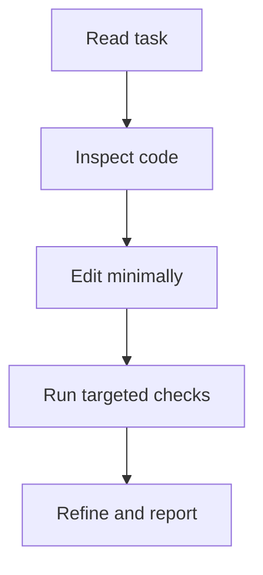

# Aider Conventions

## Coding Conventions
- Prefer explicit, descriptive names over abbreviations.
- Keep functions focused and cohesive.
- Preserve existing code style and formatting in each file.
- Avoid unrelated refactors during task completion.

## Planning and Documentation Diagram Policy

- Every new or updated planning/design document must include at least one Mermaid diagram.
- The diagram should appear near the top (after objective/scope) and provide a high-level flow.
- Keep diagrams synchronized with the written steps when plans evolve.
- Prefer simple `flowchart TD` diagrams for execution plans and phase sequencing.
- If a document has multiple phases/modules, include one top-level diagram plus optional focused diagrams.

## Repository Conventions
- Follow OCI module patterns when building provider equivalents.
- Keep validation logic close to configuration decisions.
- Keep generated artifact naming consistent with existing Terraform workflow.

## Change Discipline
- Make smallest meaningful diffs.
- Update docs for user-visible behavior changes.
- Add or adjust tests when behavior changes.

## Working Loop

